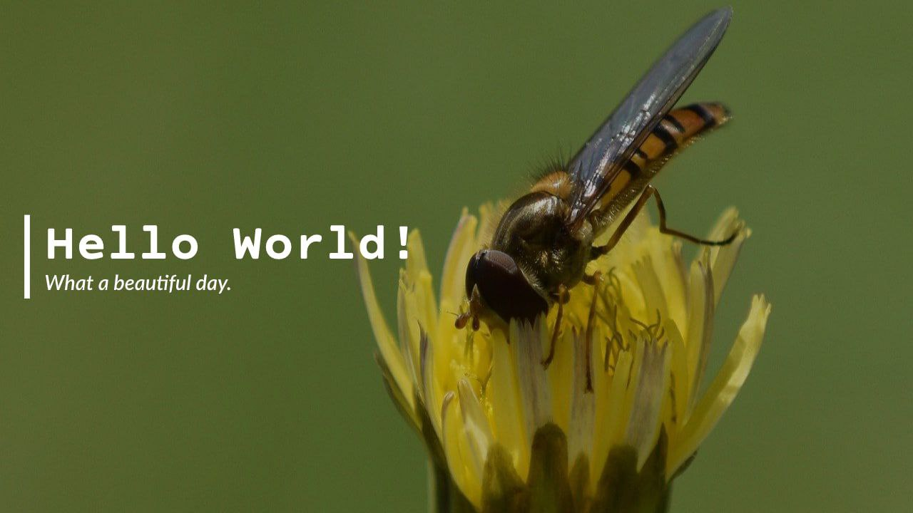
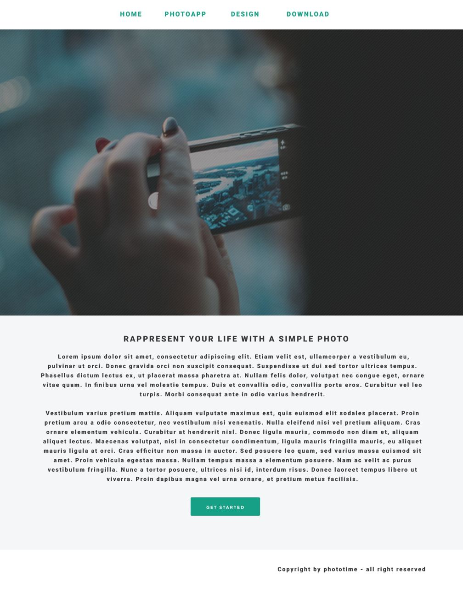
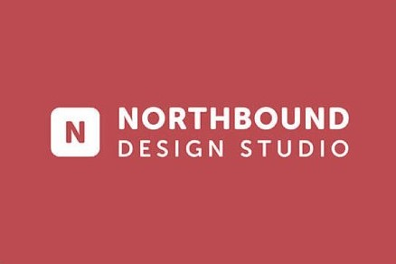

# CSS styles🎨

## Task1✒️
### Description: 
Şəkildə göstərilən dizayna uyğun tapşırığı həll edin:
* arxa fon - şəkil, yazı isə qarşıda olacaq
* arxan fon şəkili **"arı.png"** formatında folder-də olacaq

## Task2✒️
### Description:
* Verilən səhifəni olduğu kimi yığın
* Şəkil optional'dır. Başqa şəkil də qoya bilərsiniz. Amma çalışın ölçüləri eyni olsun

## Task3✒️
### Description:
* Göstərilən şəkilə uyğun sadə bir sayt yaratmağa çalışın.
* Figma dizaynı verilmədiyindən gözəyarı şəkildə ölçüləri verməyə çalışın.
* Aşağıdakı 6 şəkili istədiyiniz bir şey qoya bilərsiniz. Amma diqqət edin ki, hamısının ölçüsü eyni olsun.

## Task4:
### Description:
- Figma linkinə daxil olun:
- Verilən dizayna uyğun olaraq saytı qurun
- Hər taskın özünə aid olan linkə daxi olun
- Task1 ***deadline***: `28.02.2023` [Task1 design](https://www.figma.com/file/hjSmIcOfggQUyEKBPBLe1O/Task1?node-id=0%3A1&t=YIYZkI8wzqlEfsFa-1)
- Task2: ***deadline***: `02.03.2023`
[Task2 design](https://www.figma.com/file/5Qk2dJTWfkRr6d6McmRHKj/Task2?node-id=0%3A1&t=Hlhjl0kRbFW889Y8-1)
- Task3: ***deadline***: `04.03.2023`
[Task3 design](https://www.figma.com/file/epjTHFDjXsqnLlCaInu1aE/Task3?node-id=0%3A1&t=kv6DqDGV4StojY7W-1)
